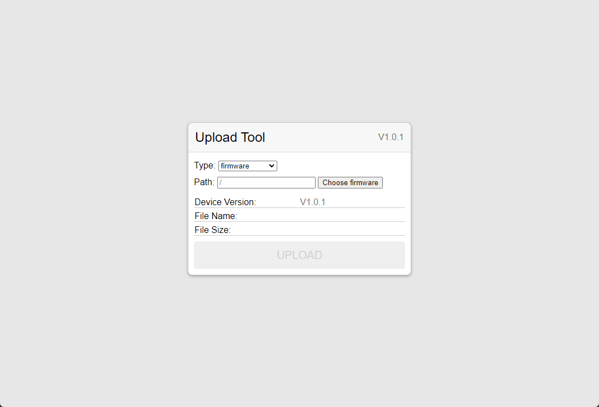
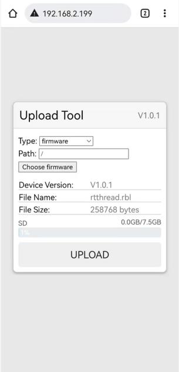

# [W601] 文件上传小工具DEMO

## 简介
本例程基于正点原子的W601开发板，使用 RT-Thread 实现一个通过 Web 将文件上传到SD卡的小工具，当前版本在源代码中内置一个Web网页，无需事先将Web文件导入到SD卡，使用起来非常方便。

本例程中的网页源码也已开源，并且考虑到从事嵌入式开发的朋友大多对于前端技术不是很熟悉，因此在网页源码中没有使用任何框架，完全使用原生 html+js+css 实现【除了打包工具，该工具只是为了将多个文件合并成一个文件】，便于理解和修改。

网页源码 > [Github](https://github.com/WKJay/upload_tool_web) | [Gitee 国内推荐访问](https://gitee.com/wangjunjie997/upload_tool_web)

- 通过Web访问

- 移动端适配
  

## 网页操作

**网页的操作指南请参照上方的网页源码进行查看。**
